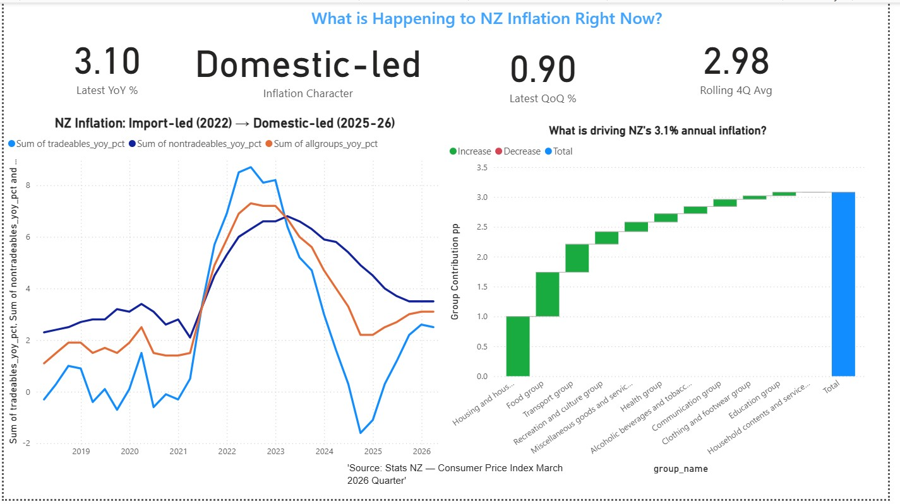
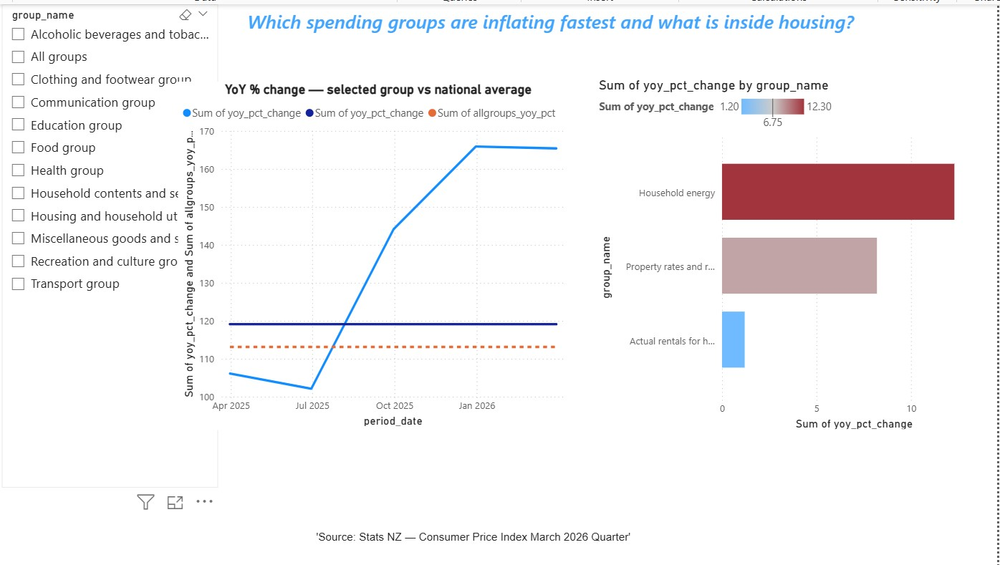
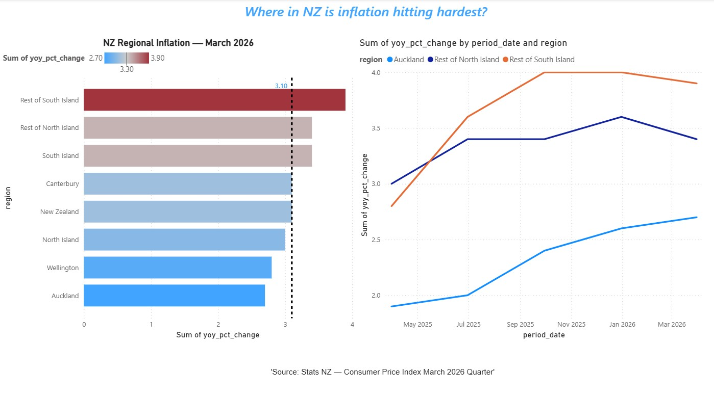

# NZ CPI Analytics — End-to-End Data Pipeline

**What is driving New Zealand's 3.1% inflation in 2026 — and is the Reserve Bank targeting the right problem?**

This project builds a complete analytics pipeline from a raw Stats NZ Excel file to a live Power BI dashboard, answering that question with data.

---

## Live Dashboard

> 💡 **Note on Interaction:** Due to institutional account cloud restrictions, the live interactive link is hosted internally. You can view the full multi-page visual layout below, or download the working standalone file from the `/powerbi/` directory to inspect the DAX model natively.

### Page 1: The Headline (March 2026 Summary)


### Page 2: Category Deep Dive


### Page 3: Regional Story


---

## Pipeline Architecture

```
Stats NZ CPI Excel (March 2026 Quarter)
          ↓
Python ETL (01_extract.py)
— Read 27-sheet Excel with header=None
— Reshape wide→long with pd.melt()
— Parse quarter strings to real dates
— Export 3 clean CSVs
          ↓
SQLite Star Schema (02_load.py)
— 5-table star schema (2 facts + 3 dimensions)
— 8 analytical SQL queries with window functions
          ↓
Snowflake Data Warehouse (03_load_snowflake.py)
— Internal Stage + COPY INTO bulk load
— is_post_covid derived column via UPDATE
— Zero-Copy Clone + Time Travel demonstrated
          ↓
Python Analysis (04_analysis.py)
— Inflation decomposition using expenditure weights
— Tradeable vs non-tradeable divergence chart
— Regional comparison across 8 NZ regions
— Housing subgroup deep dive
          ↓
Power BI Dashboard (NZ_CPI_Dashboard.pbix)
— Connected to processed data
— 3 interactive pages
— 5 custom DAX measures
```

---

## Key Findings

### 1. NZ inflation has completely changed character since 2022

In 2022 inflation was **import-driven** — tradeables rose 8.7% YoY from global supply chains and fuel. By March 2026, tradeables are at 2.5% (nearly normal) but **non-tradeables remain at 3.5%** — domestic costs like energy, council rates, and services are now the problem. This explains why the Reserve Bank has been slow to cut interest rates — the remaining inflation is the domestic kind that interest rates struggle to fix.

### 2. Housing headline (3.4%) is driven by energy and rates — not rent

Inside the Housing & Utilities group:
- Household energy: **+12.3% YoY**
- Property rates: **+8.2% YoY**
- Actual rent: **+1.2% YoY** (nearly stopped in Auckland)

Most people assume rent is the main housing cost driver. The data proves otherwise.

### 3. Auckland has the LOWEST inflation in NZ — not the highest

| Region | YoY % (Mar-26) |
|---|---|
| Rest of South Island | 3.9% ← highest |
| Rest of North Island | 3.4% |
| Canterbury | 3.1% |
| New Zealand (national) | 3.1% |
| Wellington | 2.8% |
| **Auckland** | **2.7% ← lowest** |

The national 3.1% average hides a 1.2 percentage point gap between regions.

### 4. Transport drove the March 2026 quarterly spike

Transport contributed **24.1% of the 0.9% quarterly rise** — diesel up 11.3%, petrol up 3.5%. Most CPI coverage focuses on the annual rate. The quarterly driver is a different story.

### 5. Food and Housing have been persistently above national CPI for all 5 quarters

These are the two groups every NZ household feels most directly. Every other group had at least one quarter below the national average.

---

## Dashboard Pages

### Page 1 — The Headline
4 KPI cards (Annual inflation 3.1%, QoQ 0.9%, Character: Domestic-led, 4Q Avg 2.98%) + waterfall chart showing group contributions + the great reversal line chart.

### Page 2 — Category Deep Dive
Interactive slicer to select any spending group. Trend line showing selected group vs national average. Subgroup breakdown bar chart with conditional formatting.

### Page 3 — Regional Story
Regional inflation bar chart (Mar-26) + trend lines comparing Auckland vs South Island over 5 quarters.

---

## Repository Structure

```
NZ-CPI-Analytics/
├── data/
│   ├── raw/                          # Original Stats NZ Excel file
│   └── processed/                    # 3 clean CSVs from Day 1
│       ├── cpi_allgroups.csv         # 33 rows — 2018–2026 time series
│       ├── cpi_groups.csv            # 280 rows — 56 groups x 5 quarters
│       └── cpi_regional.csv          # 40 rows — 8 NZ regions x 5 quarters
├── etl/
│   └── 01_extract.py                 # Extract & transform from Excel
├── sql/
│   ├── 02_load.py                    # Load CSVs into SQLite star schema
│   ├── analysis.sql                  # 8 analytical queries with window functions
│   └── 03_load_snowflake.py          # Load into Snowflake with COPY INTO
├── notebooks/
│   ├── 04_analysis.ipynb             # 4 Python analyses with charts
│   └── charts/                       # PNG chart outputs
│       ├── chart1_decomposition.png
│       ├── chart2_reversal.png
│       ├── chart3_regional.png
│       └── chart4_housing.png
├── snowflake/                        # Snowflake screenshots
├── powerbi/
│   ├── NZ_CPI_Dashboard.pbix         # Power BI report file
│   └── screenshots/                  # Dashboard page screenshots
└── .gitignore
```

---

## How to Reproduce

### Prerequisites
```
Python 3.10+
pip install pandas numpy matplotlib openpyxl snowflake-connector-python
```

### Step 1 — Extract and clean the data
```bash
python etl/01_extract.py
# Output: data/processed/ — 3 clean CSVs
```

### Step 2 — Load into SQLite and run analysis queries
```bash
python sql/02_load.py
# Output: data/nz_cpi.db — 5-table star schema
# Then open sql/analysis.sql in DB Browser for SQLite
```

### Step 3 — Load into Snowflake
```bash
# Set your credentials as environment variables first
python sql/03_load_snowflake.py
# Output: NZ_CPI_DB.ANALYTICS — 6 tables in Snowflake
```

### Step 4 — Run Python analysis and generate charts
```bash
python notebooks/04_analysis.py
# Output: notebooks/charts/ — 4 PNG charts
```

### Step 5 — Open Power BI dashboard
Open `powerbi/NZ_CPI_Dashboard.pbix` in Power BI Desktop.

---

## Key SQL Techniques Used

| Technique | Used for |
|---|---|
| `LAG() OVER` | Detecting the March 2023 inflation reversal point |
| `RANK() OVER` | Ranking spending groups by inflation rate |
| `AVG() OVER ROWS BETWEEN` | Rolling 4-quarter smoothed trend |
| `CTE (WITH clause)` | Identifying persistently above-CPI groups |
| `Self-join` | Regional comparison against Auckland benchmark |

---

## Key Python Techniques Used

| Technique | Used for |
|---|---|
| `pd.melt()` | Reshaping wide Excel data to long format |
| `pd.to_datetime()` | Parsing quarter strings to real dates |
| `fill_between()` | Shading import-led vs domestic-led periods |
| `plt.subplots()` | Dual-panel reversal chart |
| Weighted contribution | Decomposing 3.1% headline into group contributions |

---

## Data Source

**Stats NZ — Consumers Price Index: March 2026 Quarter**
Published: 21 April 2026
URL: https://www.stats.govt.nz/topics/consumers-price-index

Official quarterly CPI data covering March 2018 to March 2026. Contains index values, quarterly and annual percentage changes, expenditure weights, and regional breakdowns across 8 NZ regions.

---

## Tools & Technologies

`Python` `Pandas` `Matplotlib` `SQLite` `SQL` `Snowflake` `Power BI` `DAX` `Azure` `Git`

---

## Author

**Priyanka Pradhan**
Data Analyst | Auckland, New Zealand
[LinkedIn](https://www.linkedin.com/in/priyanka--pradhan/) | [Portfolio](https://priyanka212-pradhan.github.io/Portfolio/) | [GitHub](https://github.com/Priyanka212-pradhan)

*Completed Master of Information Technology — Auckland Institute of Studies, May 14 2026*
*Available full-time | Post-Study Work Visa*
